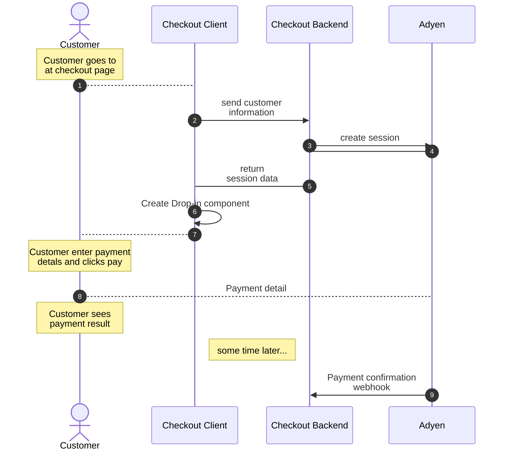

```mermaid
sequenceDiagram
autonumber

actor customer as Customer
participant client as Checkout Client
participant backend as Checkout Backend
participant adyen as Adyen


note over customer: Customer goes to <br>at checkout page
customer --> client: 
client ->> backend: send customer<br>information
backend->>adyen: create session
adyen -> backend: 
backend -> client: return <br>session data 

client ->> client: Create Drop-in component
client --> customer: 
note over customer: Customer enter payment<br>detals and clicks pay
customer --> adyen: Payment detail
note over customer: Customer sees<br>payment result

note right of client: some time later...
adyen ->> backend: Payment confirmation<br>webhook
```